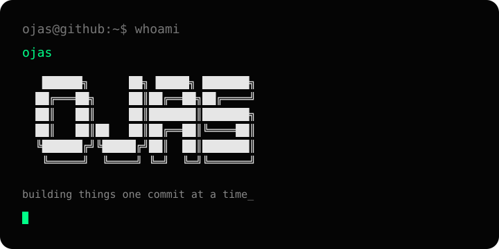

<h2><code>ojas@github ~ $ ./profile.sh</code></h2>

  
<table><tr>
<td valign="top" width="42%"></td>
<td valign="top" width="58%"></td>
</tr></table>
 
<h3><code>ojas@github ~ $ ls ./projects</code></h3>

<a href="https://github.com/OjasJindal/LIVEBY">LIVEBY</a> · <a href="https://github.com/OjasJindal/MOVIE-RECOMMENDER">MOVIE-RECOMMENDER</a> · <a href="https://github.com/OjasJindal/Library-Management-">Library-Management</a>

<h3><code>ojas@github ~ $ cat /etc/links</code></h3>

<a href="https://github.com/OjasJindal">GitHub</a> · <a href="https://github.com/OjasJindal?tab=repositories">All projects</a>

SVG + Python + GitHub Actions · no JavaScript · no third-party stats service

